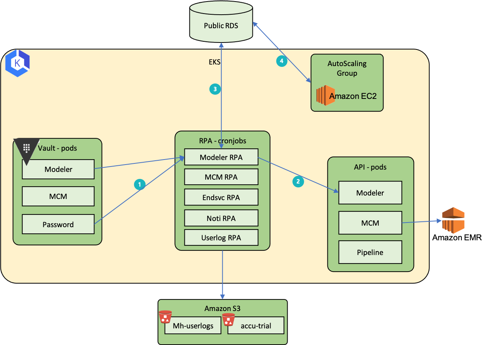
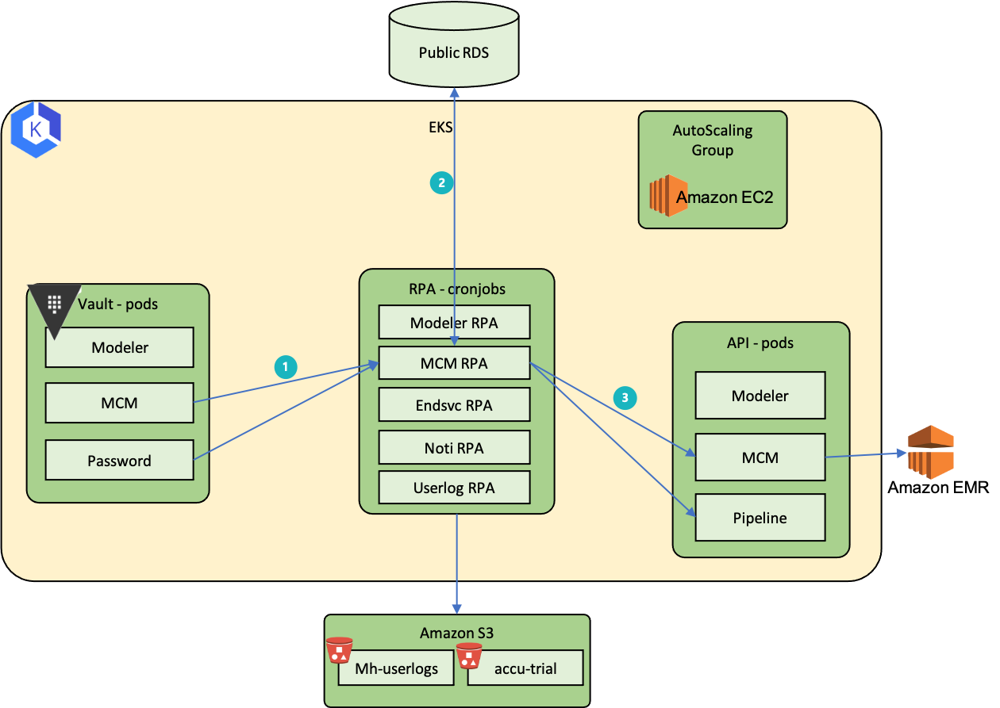
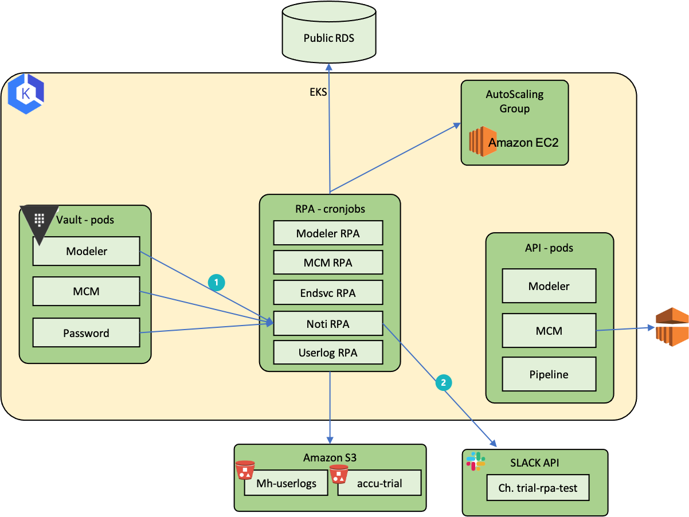
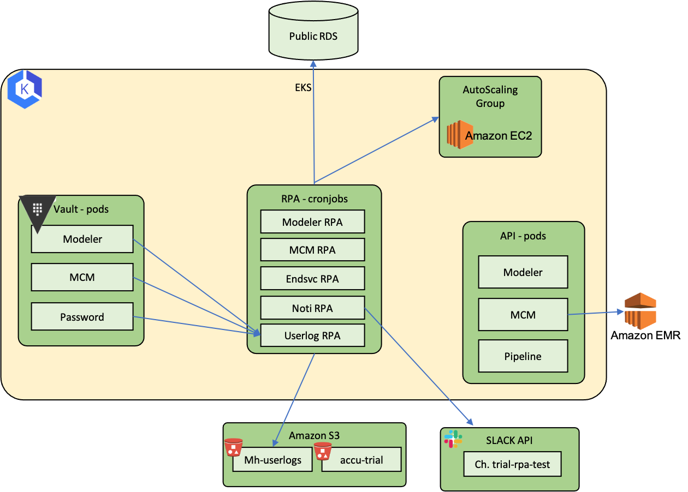

# Accuinsight 자동화

## 1. 개요
- Trial 계정발급 프로세스 개선

- 문제 상황
    1. 계정 발급 및 리소스 생성이 반복적이고 비효율적 ( 계정 당 40분 )
        - 발급과정이 복잡함 ( 매뉴얼 : https://myshare.skcc.com/pages/viewpage.action?pageId=108190288 ) 
          & 관리자가 바뀔 때 마다 인수인계 복잡함. (휴가를 가야한다거나...)
        
        - 계정발급절차
            - 계정생성 / 메일확인 및 패스워드 설정 / 로그인 및 약관동의 / 서비스구매 / 서비스 관리자계정으로 권한부여
        - 리소스 생성
            - 클러스터 생성 및 스케쥴링 / 클러스터 권한부여 / 계정그룹설정 / IAM 생성(정책 및 권한 할당) / S3 생성 및 Pipeline 등록 / 모델러 프로젝트 생성 및 리소스할당 / 워커노드 생성(autoscaling그룹지정)

    2. 퍼블릭 서비스를 시작하면서, Trial사용 요청 증가로 해당 작업 공수 증가
        - 교육 및 데모 증가

        - 계정이 늘어날 수록 관리해야 할 계정 및 Cloud 리소스 증가
            - 계정 및 패스워드 관리의 일관성이 없음.
        

> 발급과정 단순화 & 관리포인트 제거

## 2. 설계
 </img>  

- 개요  
RPA 프로그램은 1번 Vault에서 기록된 정보를 파싱하여 2번, 3번의 과정을 자동화 하는 역할을 수행합니다.

 </img>

- Modeler RPA (Cronjobs - 1시간마다 실행) 
    1. Vault Password에서 계정정보 파싱, Vault Modeler에서 프로젝트 정보 및 스케쥴 정보를 파싱

    2. 프로젝트 생성 및 리소스 할당

    3. 기존의 스케쥴과 달라졌을 경우 RDS정보 업데이트

    4. AutoScaling Workernode 스케쥴링

 </img>

- MCM RPA (Cronjobs - 30분 마다 실행) 
    1. Vault Password에서 계정정보 파싱, Vault MCM에서 클러스터 정보 및 스케쥴 정보를 파싱

    2. 기존의 스케쥴과 달라졌을 경우 RDS정보 업데이트 (Todo: 변경필요 API로 확인 / 코드리팩토링)
    3. EMR 생성 및 생성 후 클러스터 할당

 </img>

- Endsvc RPA (Cronjobs - 매일 아침 9시 실행)
    1. Vault에서 계정 및 사용기간 정보 파싱 후, 사용기간 만료된 계정 탐색
    2. 모델러 : 프로젝트 워크스페이스 등 리소스 및 스케쥴 해제 
    파이프라인 : 사용한 워크플로우 및 모델 데이터셋 등 삭제 
    MCM : EMR 스케쥴 제거

    3. AutoScaling 워커노드 스케쥴 삭제 및 종료
    4. S3 데이터 초기화 
    5. Cloudz : 사용기간 만료된 계정 패스워드 변경
    6. 변경된 패스워드 Vault에 update

 </img>

- Noti RPA
    1. Vault에서 정보 파싱 및 금일 현황 탐색
    2. Slack API 로 금일 리소스 사용현황 사용기간 등 알림

 </img>

- Noti RPA
    1. Vault에서 정보 파싱 및 금일 현황 탐색
    2. Slack API 로 금일 리소스 사용현황 사용기간 등 알림

## 3. 기능 개발 및 구체화
-----------------------------------------------
### Manage Tool (Vault)
-----------------------------------------------
0. 계정발급 (trial_user01 ~ trial_user45)
    - VAULT
        - 해당 계정에 대한 정보관리
            - Password
            - MCM (사용 스케쥴 및 사이트 정보 등)
            - Modeler (사용 스케쥴 및 사이트 정보 등)

------------------------------------------------
### RPA Program ( Cronjobs )
------------------------------------------------
1. MCM
    - Cronjobs 30분마다 실행 (SPOT 클러스터가 내려가는 이슈로 인해)
        1. 클러스터 생성
        2. 클러스터 스케쥴링
        3. 클러스터 특정 계정에 할당

------------------------------------------------
2. Modeler
    - Project 생성 및 계정 할당  개발 완료 
        - 완료 : 추가로, 지정된 프로젝트 이 외의 프로젝트를 생성시에는 자동삭제 로직 추가해야함
        - 기존에 vault에서 관리 안하는 같은 이름의 project가 있을 때, 처리필요 

    - Cronjobs 60분마다 실행 (사용시간 외 리소스 사용 불가하도록 개발)
        - 스케쥴링
            - CORE TIME (사용시간 내)
                1. EKS Autoscaling 그룹 워커노드 Scale out

            - NON CORE TIME (사용시간 외)
                1. Project 내 리소스(workspace / deploy ...) STOP
                2. EKS Autoscaling 그룹 워커노드 Scale in
        - 
------------------------------------------------
3. End service
    - 서비스 사용기간이 종료 되었을 때, 리소스 해제
        - CloudZ 패스워드 변경
            - Cloudz Password Change
                - Session create
                - Post -> Password Change

            - Vault
                - Password Management
                    - Read / Update secret
                    > 변경 규칙 -> "Random prefix" + random d + "특수문자"
            
        - Pipeline 자원 해제 (진행중)
            - SSO TOKEN (완)
                - GET
            - WORKFLOW (완)
                - GET / DELETE
            - DATASET (완)
                - GET / DELETE
            - MODELS (완)
                - GET / DELETE
            - S3 (Cloud) (완)
                - CREATE / DELETE
            - 프로젝트 삭제 (미완료)

        - 모델러 자원 해제 (진행중)
            - Project
                - 관리
                    > 계정 사용중에는, STOP으로 비용절감
                    >
                    > 사용이 끝난 후에는, 삭제 
                    - Workspace
                        - GET / STOP / DELETE 
                    - Deploy 
                        - GET / STOP / DELETE
                    - AutoML
                        - GET / / DELETE
                    - AUTODL
                        - GET / / DELETE
                    - 모델 모니터링 (DRIFT)
                        - GET / DELETE
                
                - ASSET
                    - Deploy Storage
                        - GET / DELETE
                    
                    - 분석이미지
                        - GET / DELETE

        - MCM 자원 해제
            - Cluster Schedule 삭제

------------------------------------------------

4. Slack Notifications
    - Vault 정보 파싱
        - 계정 사용현황
        - 금일 리소스 사용현황 관리

------------------------------------------------
------------------------------------------------

## 4. Trouble shooting
- MCM
    - SPOT 클러스터가 내려가는 이슈
- Modeler
    - 사용시간 외 리소스 사용 불가하도록 알고리즘 개발 
    - 주 7일 24시간제공 -> 주 5일 근무시간(9~18)제공 -> 68% 비용절감
- Slack
    - <a href = 'https://github.com/kmh03214/BigData_Platform/blob/main/Slack/01%20Slack%20error%20channel_not_found.md'>Error : channel_not_found (Python SLACK API 연동)</a>
    - 글자 포맷팅 깨짐 이슈 미완료
