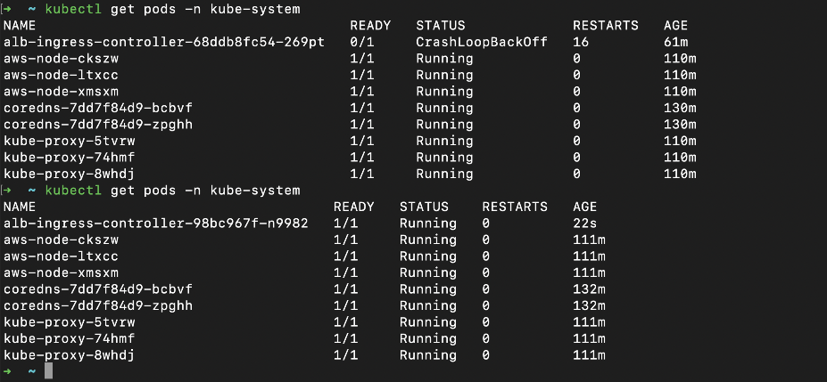
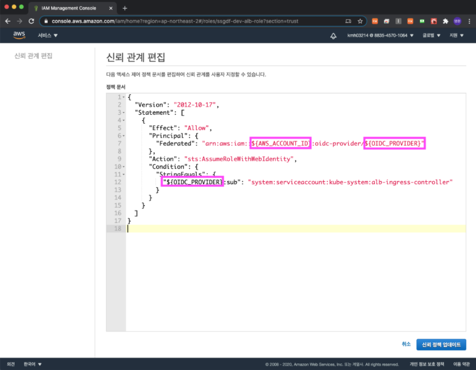

# alb-ingress-controller Crashloopbackoff Error 해결방법

## 개요
alb-ingress-controller 배포 후, Pod가 Running → Restart → Crashloopbackoff Error 가 반복되는 경우에 대한 해결 방법

## 현상확인
현상은 다음과 같습니다. 명령어창에서 다음 명령어를 실행 했을 때, alb-ingress-controller~ 의 RESTARTS counts가 올라가면서 STATUS가 Running 이었다가 CrashLoopBackOff로 변하면서 반복이 되는 현상 

```zsh
$ kubectl get pods -n kube-system
```



## 문제해결책
해당 문제는 alb-ingress-controller 배포 후 신뢰관계를 편집 할 때, 잘못 수정한 경우 발생할 확률이 있습니다.
예를들면 ${OIDC_PROVIDER} 가 두 개를 수정해야 하는데, 1개만 수정 했을 경우에 이 에러가 발생합니다.
또는, ${OIDC_PROVIDER} 에 해당 내용을 넣을 때, https:// 를 포함해서 넣는 경우 다른 에러가 발생할 수 있습니다.
이 부분을 제대로 수정하면 해결이 됩니다.
