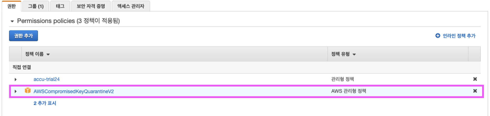

# AWS IAM 권한에 AWSCompromisedKeyQuarnactineV2 정책추가 (Deny)

어느순간, AWSCompromisedKeyQuarnactineV2라는 정책이 추가가 되는데, 왜 그런지 알아봅시다.



## 해당 정책내용은 아래 json파일과 같습니다.
잘 보시면, effect에 Deny로 되어있는 걸 볼 수 있는데요.
이건, AWS에서 사용자의 정보의 유출이 감지되어 해당 리소스에 접근을 막아 놓은 상황입니다.

예를들면, AWS의 AccessKey나 SecretKey를 공개적인 장소(깃허브 / 블로그 등)에 올려서 정보가 유출 되었을 떄, 이를 자동으로 탐색하고 AWS에서 경고메일을 보내주는데, 그와 비슷한 시기에 리소스거부 정책이 추가됩니다.

```json
{
    "Version": "2012-10-17",
    "Statement": [
        {
            "Effect": "Deny",
            "Action": [
                "ec2:RequestSpotInstances",
                "ec2:RunInstances",
                "ec2:StartInstances",
                "iam:AddUserToGroup",
                "iam:AttachGroupPolicy",
                "iam:AttachRolePolicy",
                "iam:AttachUserPolicy",
                "iam:ChangePassword",
                "iam:CreateAccessKey",
                "iam:CreateInstanceProfile",
                "iam:CreateLoginProfile",
                "iam:CreatePolicyVersion",
                "iam:CreateRole",
                "iam:CreateUser",
                "iam:DetachUserPolicy",
                "iam:PassRole",
                "iam:PutGroupPolicy",
                "iam:PutRolePolicy",
                "iam:PutUserPermissionsBoundary",
                "iam:PutUserPolicy",
                "iam:SetDefaultPolicyVersion",
                "iam:UpdateAccessKey",
                "iam:UpdateAccountPasswordPolicy",
                "iam:UpdateAssumeRolePolicy",
                "iam:UpdateLoginProfile",
                "iam:UpdateUser",
                "lambda:AddLayerVersionPermission",
                "lambda:AddPermission",
                "lambda:CreateFunction",
                "lambda:GetPolicy",
                "lambda:ListTags",
                "lambda:PutProvisionedConcurrencyConfig",
                "lambda:TagResource",
                "lambda:UntagResource",
                "lambda:UpdateFunctionCode",
                "lightsail:Create*",
                "lightsail:Delete*",
                "lightsail:DownloadDefaultKeyPair",
                "lightsail:GetInstanceAccessDetails",
                "lightsail:Start*",
                "lightsail:Update*",
                "organizations:CreateAccount",
                "organizations:CreateOrganization",
                "organizations:InviteAccountToOrganization",
                "s3:DeleteBucket",
                "s3:DeleteObject",
                "s3:DeleteObjectVersion",
                "s3:PutLifecycleConfiguration",
                "s3:PutBucketAcl",
                "s3:DeleteBucketOwnershipControls",
                "s3:DeleteBucketPolicy",
                "s3:ObjectOwnerOverrideToBucketOwner",
                "s3:PutAccountPublicAccessBlock",
                "s3:PutBucketPolicy",
                "s3:ListAllMyBuckets"
            ],
            "Resource": [
                "*"
            ]
        }
    ]
}
```

그럼 해결은 어떻게 하냐?
## 해결방법
간단합니다, 정책 옆에 X를 눌러서 정책을 없애면 됩니다.

끝.