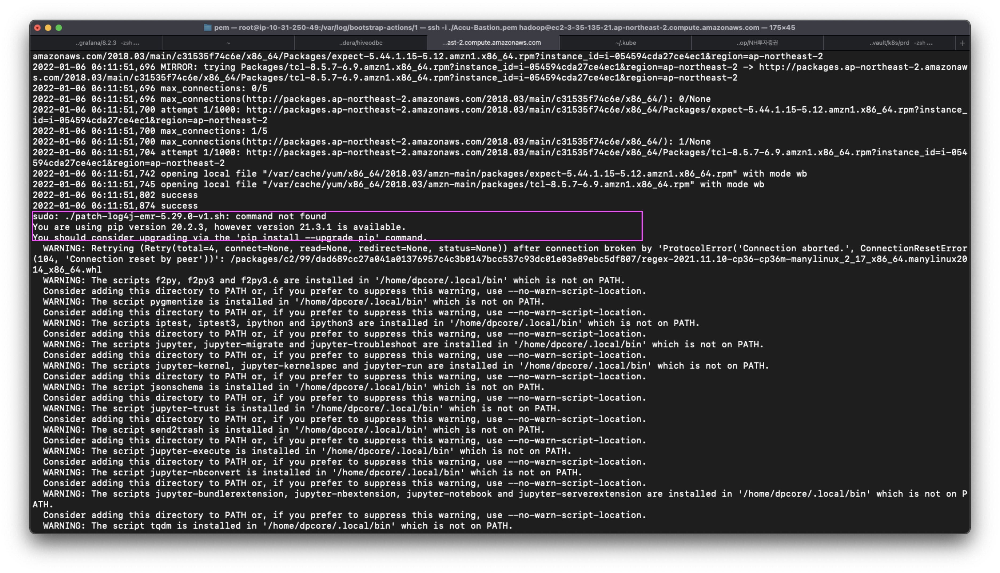

# EMR Log4j 취약점 조치 내용

부트스트랩 파일 실행 시 아래 두줄 추가

```bash
#log4j 패치 - 버전별로 상이
sudo aws s3 cp s3://accuinsight/20/batch/ssg/patch-log4j-emr-5.29.0-v1.sh ./
sudo sh ./patch-log4j-emr-5.29.0-v1.sh
```


- 기존 적용 되어있던 명령어가 다음과 같았는데, s3에서 파일을 복사해왔을 때 실행권한이 없어서 실행 되지 않음.

</img>

- 실행 되지 않는 건, EMR 마스터노드에 접속하여 bootstrap log를 확인하여 알 수 있음
    - 부트스트랩 실행되는 기본 경로는, /emr/instance-controller/lib/bootstrap-actions/1 에 들어있음
    - 부트스트랩 실행 로그는 /var/log/bootstrap-actions/1/ 안에 들어있음.

```bash
#log4j 패치 - 버전별로 상이
sudo aws s3 cp s3://accuinsight/20/batch/ssg/patch-log4j-emr-5.29.0-v1.sh ./
sudo ./patch-log4j-emr-5.29.0-v1.sh
```

## 느낀점
실제로, 실행되는지 어떻게 실행되는지 체크가 필요함. (일을 진행하는 과정중에 의심을 한번 해보자)

다른 팀원이 적용한 내용을 그대로 가져다 쓸 때, 실행되는지 로그를 체크 하지 않았더라면, 회사 전체 사이트에 적용되어 리스크가 발생될 여지가 생겼을 것.

