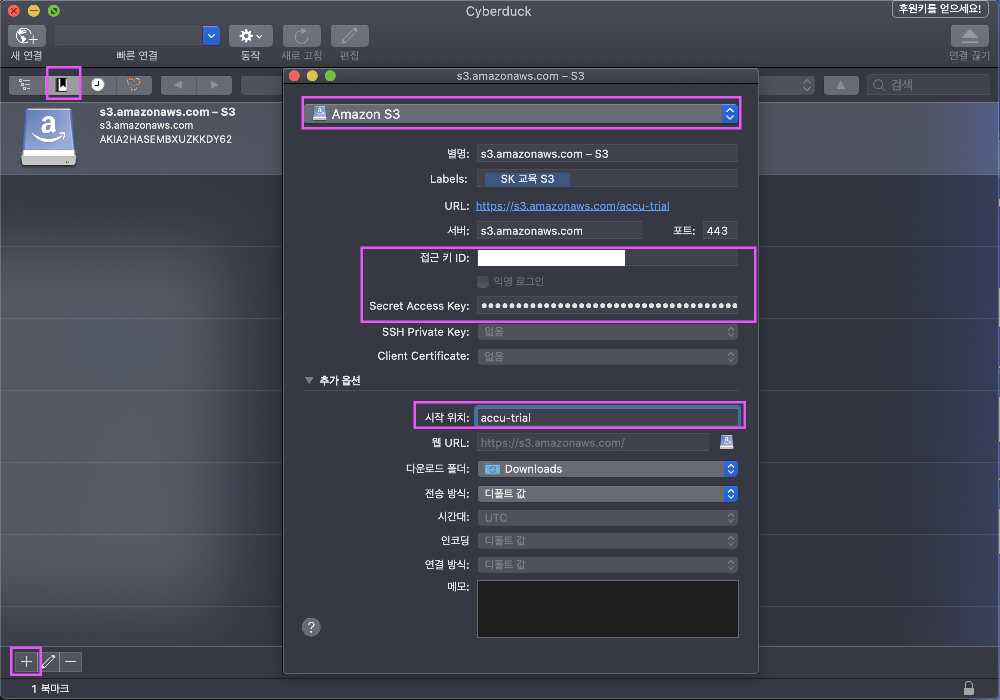
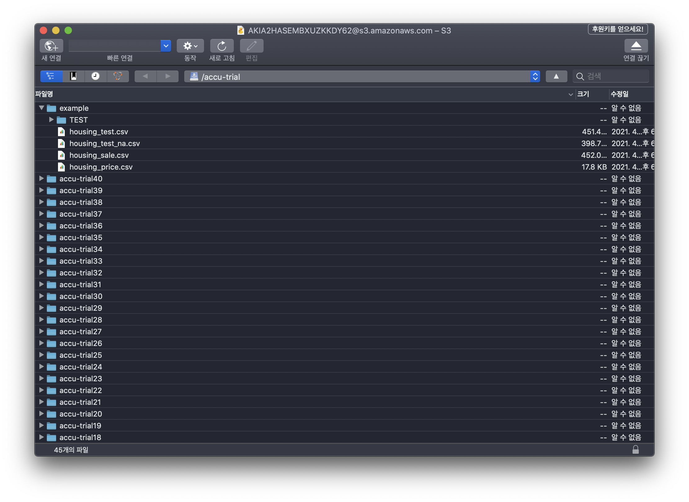

# Cyberduck을 사용하여 S3에 데이터 업로드하기
Cyberduck Download link : 

## 1. Cyberduck 실행 후 버킷정보 등록하기.
아래 그림을 참조하여 1,2,3번을 수행합니다.
1. 좌측상단 북마크를 클릭합니다.
2. 좌측하단 + 버튼을 클릭하여 버킷을 추가합니다.
3. +버튼을 클릭하면 창이 하나 뜨게 됩니다. 
    - 창 상단에 옵션을 Amazon S3로 선택 후 추가옵션을 클릭합니다.
    - 전달받은 AccessKey를 접근키 ID에, Secret Access Key를 Secret Access Key에 입력합니다
    - 추가옵션에 시작위치를 accu-trial로 설정합니다.
</img>

## 2. 권한이 있는 폴더에 데이터 업로드하기.
위에서 생성한 버킷을 클릭하게 되면, 아래 그림과 같이 폴더구조가 보입니다. 접근 권한이 있는 폴더에 데이터를 드래그앤 드랍으로 업로드합니다.

여기서 사용할 수 있는 폴더는 example(모든 계정이 접근가능한 공용폴더)과 본인계정명의 폴더(본인만 접근가능한) 입니다.
</img>