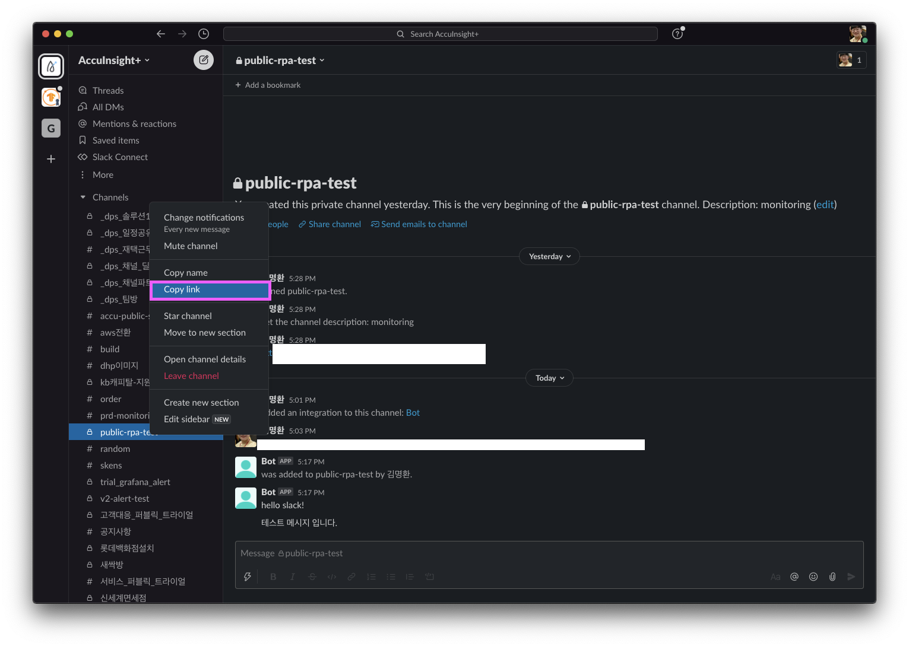

# error : channel_not_found 해결하기 (Slack python api 연동)

## Python Slack Bot 환경세팅

아마 대부분이 https://wooiljeong.github.io/python/slack-bot/ 여기 글을 참고 할 것 같다.

나도 이 글을 참고하다가 안되는 부분이나 막히는 부분을 추가하고자 한다.


## python에서 slack api를 연동

slack api를 사용하기 위해서는 여러가지 방법이 있다. 사실 어느것을 사용하던 상관 없다. 하지만 위 글을 따라하다보면, channel_not_found에러를 만나게 될 것이다... (안만나면 좋은거고 ^^)

1) requests api 사용 (위 글에 나온대로)
```python
import json
import requests
from pandas.io.json import json_normalize


slack_token = "xoxb- ..."
# 채널 이름
ChannelName = "채널 이름(id아님)"

# 채널 조회 API 메소드: conversations.list
URL = 'https://slack.com/api/conversations.list'

# Bot으로 등록할 댓글 메시지 문구
message = f"""
테스트 메시지 입니다.
"""

# 파라미터
data = {'Content-Type': 'application/x-www-form-urlencoded',
        'token': slack_token,
        'channel': channel_id, 
        'text': message,
        'reply_broadcast': 'True'
        } 

# 메시지 등록 API 메소드: chat.postMessage
URL = "https://slack.com/api/chat.postMessage"
res = requests.post(URL, data=data)
```


2) 라이브러리 (slack_sdk... 등) 사용
> 주의사항 : 여기에는 python version 3.6 이상이 필요하다.
>
> 설치는 pip3 install slack_sdk

```python
import json
import requests
from slack_sdk import WebClient

client = WebClient(token='xoxb- ....')
channel_id = "C로 시작하는 ~~~ 코드"

result = client.chat_postMessage(
channel=channel_id,
text='hello slack!'
)
print(result)
```


## Trouble Shooting

### 1. Bot계정 초대하기
일단 따라하면서 막히는거 1번째가, 다음 채널에 Bot 계정 초대하기 일 것이다. 
 </img>

나는 slack app 버전이 달라서 그런건지 저걸 찾을 수가 없었다..
해결방법은 슬랙 앱에서 해당 채널을 우클릭하여
1. Open Channel details를 클릭
2. 해당 채널에서 Integrations를 클릭하여 Apps에 Add apps를 클릭후 내가 만든 Bot을 초대해야한다.

그렇지 않으면, 분명 다음과 같은 메세지를 구경하면서 삽질하게 될거다... ㅋ.ㅋ
```python
{'ok': False, 'error': 'channel_not_found'}
```

 </img>

 </img>


### 2. Channelname vs Channelid
따라하면서 막히는 부분 2번째는 아마, 위 코드에 적혀있는 channelid와 channelname과의 혼동일 것이다.

channelname은 말그대로 슬랙ui에서 왼쪽에 보이는 일반적인 채널명이다.

channelid는 채널의 고유 id이다. 이 id는 채널 우클릭 후 copy link를 하고 나면 uri 뒤에 붙는 c로 시작하는 문자열이다.
https://accuinsight.slack.com/archives/ { C--------- }

 </img>